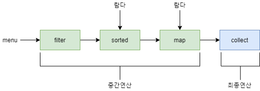

# 4.4. 스트림 연산

스트림 인터페이스의 연산은 크게 두 가지로 구분할 수 있다.

- 중간 연산 itermediate operation
    
    연결할 수 있는 스트림 연산
    
    filter, map, limit 등으로 서로 연결하여 파이프라인을 형성한다.
    
- 최종 연산 terminal operation
    
    스트림을 닫는 연산
    
    collect로 파이프라인을 실행한 다음 닫는다.
    

```java
List<String> names = menu.stream() // 요리 리스트에서 스트림 얻기
   .filter(dish -> dish.getCalories() > 300) // 중간 연산
   .map(Dish::getName) // 중간 연산
   .limit(3) // 중간 연산
   .collect(toList()); // 스트림을 리스트로 변환
```



## 4.4.1. 중간 연산

filter나 sorted 같은 중간 연산은 다른 스트림을 반환한다. 따라서 여러 중간 연산을 연결해 질의로 만들 수 있다.

중간 연산의 중요한 특징은 단말 연산을 스트림 파이프라인에 실행하기 전까지는 아무 연산도 수행하지 않는다는 것, 즉 게으르다(lazy)는 것이다. 중간 연산을 합친 다음에 합쳐진 중간 연산을 최종 연산으로 한번에 처리하기 때문이다.

> 람다가 현재 처리 중인 요리를 출력해서 스트림 파이프라인 확인
> 

```java
List<String> names = menu.stream()
        .filter(dish -> {
          System.out.println("filtering " + dish.getName());
          return dish.getCalories() > 300;
        })
        .map(dish -> {
          System.out.println("mapping " + dish.getName());
          return dish.getName();
        })
        .limit(3)
        .collect(toList());
    System.out.println(names);
```

스트림의 게으른 특성 덕분에 **쇼트서킷**, **루프 퓨전** 등의 최적화 효과를 얻을 수 있다.(다음 장에서 자세히 설명한다)

> - 쇼트 서킷: 모든 것을 iteration 하지 않고 일찍 끝나는 것
> - 루프 퓨전: 다른 연산이 한 과정으로 병합되는 것
> - ex. steam.filter.map.limit 의 코드가 있으면 filter, map 이 한 과정으로 병합되고, limit 이 쇼트서킷 된다.
> 

## 4.4.2. 최종 연산

최종 연산은 스트림 파이프라인에서 결과를 도출한다. 이를 통해 List, Integer, void 등 스트림 이외의 결과가 반환된다.

아래의 forEach는 menu의 각 요리에 람다를 적용한 다음 void를 반환하는 최종 연산이다. System.out.println을 forEach에 넘겨주면 menu에서 만든 스트림의 모든 요리를 출력한다.

```java
menu.stream().forEach(System.out::println);
```
> 1. stream() 메서드를 사용하여 List<Dish> 객체 menu를 Dish 객체의 스트림으로 변환한다. 이렇게 하면 중간 스트림 작업이 생성된다.
> 2. 스트림에 forEach 최종 연산을 적용한다. (System.out::println 람다식을 인수로 사용)
> 3. forEach 작업은 스트림의 각 요소를 반복하며, 각 Dish 개체에 대해 println 메서드가 호출된다.

> 이 코드는 `menu` 목록의 각 `Dish` 개체를 가져와서 `println` 메서드를 사용하여 콘솔에 출력한 다음 모든 개체가 처리될 때까지 다음 `Dish` 개체로 이동한다.

## 4.4.3. 스트림 이용하기

스트림 이용 과정은 세 가지로 요약할 수 있다.

- 질의를 수행할 (컬렉션 같은) 데이터 소스
- 스트림 파이프라인을 구성할 중간 연산 연결
- 스트림 파이프라인을 실행하고 결과를 만들 최종 연산

**표 4-1. 중간 연산**

| 연산 | 형식 | 반환 형식 | 연산의 인수 | 함수 디스크립터 |
| --- | --- | --- | --- | --- |
| filter | 중간 연산 | Stream<T> | Predicate<T> | T -> boolean |
| map | 중간 연산 | Stream<R> | Function<T, R> | T -> R |
| limit | 중간 연산 | Stream<T> |  |  |
| sorted | 중간 연산 | Stream<T> | Comparator<T> | (T, T) -> int |
| distinct | 중간 연산 | Stream<T> |  |  |

**표 4-2. 최종 연산**

| 연산 | 형식 | 반환 형식 | 목적 |
| --- | --- | --- | --- |
| forEach | 최종 연산 | void | 스트림의 각 요소를 소비하면서 람다를 적용한다 |
| count | 최종 연산 | long(generic) | 스트림의 요소 개수를 반환한다 |
| collect | 최종 연산 |  | 스트림을 소비해서 리스트, 맵, 정수 형식의 컬렉션을 만든다 |